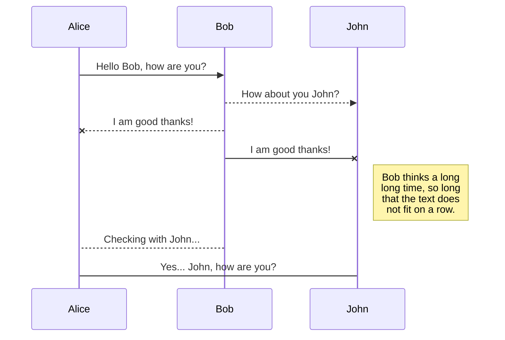

# jekyll-bootstrap4
Bootstrap 4 with Jekyll example site. 

# Notes

This repository is the result of following the steps
in
<https://simpleit.rocks/how-to-add-bootstrap-4-to-jekyll-the-right-way/>.

`packages.json` were generated with `$ yarn init`.

# Testing locally

To test the site locally:

1. `$ git clone https://github.com/marcanuy/jekyll-bootstrap4.git`
2. `$ cd jekyll-bootstrap4/`

Install [yarn](https://yarnpkg.com/lang/en/docs/install) components.

3. `jekyll-bootstrap4$ yarn install`
4. `jekyll serve`

Happy Jekylling!
## UML diagrams

You can render UML diagrams using [Mermaid](https://mermaidjs.github.io/). For example, this will produce a sequence diagram:

    enter code here

